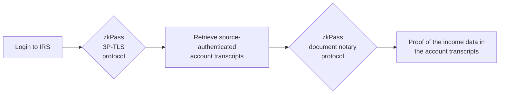
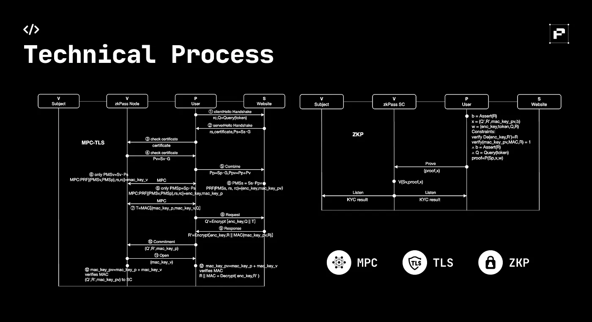
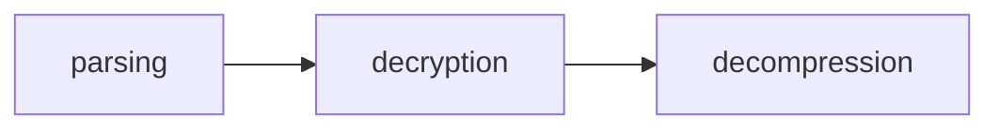
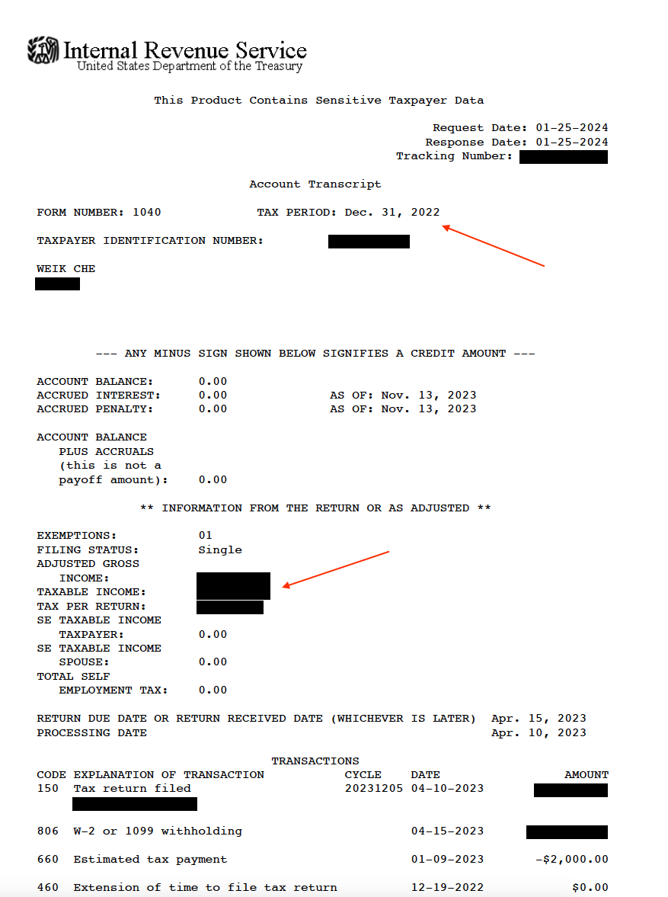

## zkPass Proof of Accredited Investorship

We have a partnership with zkPass to create an interactive proof for **IRS-reported taxable income** from the IRS website (https://www.irs.gov),
which is then used to establish the accredited investorship, through the most commonly used financial criteria for individuals:
> Income over $200,000 (individually) or $300,000 (with spouse or partner) in each of the prior two years, and reasonably expects the same for the current year

This can be done with privacy and integrity by having the users interact with the data requestor as follows:
- prove—using zkPass 3P-TLS protocol—that he/she receives the **account transcripts** for the prior two years, which would be two PDF documents,
from the [IRS Transcript Delivery System (TDS)](https://www.irs.gov/tax-professionals/transcript-delivery-system-tds). A
redacted and desensitized sample of the 2022 IRS account transcript of the author can be found [here](samples/account-sample.pdf). 
Since account transcripts contain sensitive personal information, such as the last four digits of the social security numbers (SSN) 
and abbreviated home address, the transcripts would not be revealed to the data requestor.
- prove—using zkPass data processing protocol, here RISC Zero backend—that the two account transcripts are:
  * matching the user's profile
  * new documents that are just issued by the IRS
  * matching the requested years (such as 2022)
  * have a taxable income larger than US$200,000

This can be illustrated with the following diagram.

### Background with zkPass

zkPass is a full-stack solution for **data ownership**. It consists of various tools and applications that enable verifiable data sharing, 
with privacy and integrity guarantees.

- **Data-feed:** 
  * HTTPS web connections (with [3P-TLS](https://medium.com/zkpass/a-technical-overview-of-zkpass-protocol-e28303e472e9))
  * [Passport MRZ](https://en.wikipedia.org/wiki/Machine-readable_passport)
  * [DKIM emails](https://github.com/zkemail)
  * [Digital signed PDFs](https://helpx.adobe.com/acrobat/using/signing-pdfs.html)
- **Data-processing:**
  * [Interactive ZK](https://blog.chain.link/interactive-zero-knowledge-proofs/)
  * [RISC Zero](https://github.com/risc0/risc0/)
  * [Groth16](https://github.com/iden3/circom)
- **Data-consuming:**
  * On-chain identities
  * Off-chain verification

Currently, their testnet version already supports a long list of data-feeds, including internet companies, traditional industry, governments.
- **banks and governments:** [Nagarik App](https://nagarikapp.gov.np/), [ANZ Bank](https://www.anz.com.au/personal/), [Australian myGov](https://my.gov.au/)
- **education:** [Coursera](https://www.coursera.org/), [Hubspot Academy](https://academy.hubspot.com/)
- **video games:** [GOG.com](https://www.gog.com/)
- **real-world identities and assets:** [Ferrari](https://www.ferrari.com/), [Uber](https://www.uber.com/)
- **cryptocurrency exchanges:** [OKX](https://www.okx.com/), [Binance](https://www.binance.com/en)
- **social platforms:** [Instagram](https://www.instagram.com/), [Twitter](https://twitter.com/?lang=en), [Quora](https://www.quora.com/),
  [Tiktok](https://www.tiktok.com/en/), [Medium](https://medium.com/), [Reddit](https://www.reddit.com/), [Discord](https://discord.com/)

This repository means to add IRS to the list, but the techniques present here (PDF proofs) can be generalized to a lot of 
settings. 
- An example is [CeDiploma](https://secure.cecredentialtrust.com/cecredential/overview/), an electronic diploma provider with clients including [Stanford](https://studentservices.stanford.edu/my-academics/request-transcripts-certifications/diplomas/certified-electronic-diploma) and [UC Berkeley](https://registrar.berkeley.edu/certified-electronic-credential-overview/),
which embeds the digital signature in the PDF. 
- Another example is [Docusign](https://www.docusign.com/). The signed document together with the summary document, which 
are two PDF documents, can be used to prove that signers with those email addresses made the signature. See here for an 
example [SAFT agreement](samples/docusign-form.pdf) (from https://saft-project.org/) and its [eSignature summary](samples/docusign-summary.pdf). 

Further development of our PDF proofs would enable such a big class of applications.

For IRS, we rely on the zkPass [3P-TLS](https://medium.com/zkpass/a-technical-overview-of-zkpass-protocol-e28303e472e9) protocol to prove the internet connections with the IRS website, 
which works as follows.

- The user makes the usual HTTPS connection with the IRS website, with the encrypted network traffic rerouted through the validator.
Validator here acts like a network proxy or, in laypersons' terms, a VPN. 
- After the HTTPS connection concludes, the validator asks the user to generate a zero-knowledge proof about the encrypted 
traffic data. The validator independently verifies the integrity of the TLS connection, through PKI certificates.
- As we discussed above, zkPass supports multiproof. Several backends, including RISC Zero that we use, can be used to 
generate this zero-knowledge proof. This is often a selection that optimizes performance. RISC Zero is suitable for proofs 
that involve [RAM-model computation](https://en.wikipedia.org/wiki/Random-access_machine) rather than [circuit-model computation](https://en.wikipedia.org/wiki/Circuit_(computer_science)).

This protocol has been studied for many years, all the way starting from [TLSNotary](https://tlsnotary.org/) more than a decade ago  (now, an Ethereum Foundation-funded PSE project).
Academic work including [BlindCA](https://eprint.iacr.org/2018/1022) (IEEE S&P 2019), [DECO](https://arxiv.org/abs/1909.00938) (ACM CCS 2020), 
[Oblivious TLS](https://eprint.iacr.org/2021/318) (CT-RSA 2021), [MPCAuth](https://eprint.iacr.org/2021/342) (IEEE S&P 2023), 
and [DiStefano](https://eprint.iacr.org/2023/1063) from Brave Browser has moved this forward. 

Note: zkPass also has a version of 3P-TLS protocol, implemented in their [TransGate](https://chromewebstore.google.com/detail/zkpass-transgate/afkoofjocpbclhnldmmaphappihehpma) extension, that additionally secret-shares the TLS keys among the user and the validator. We found it not necessary 
in most of today's network environment (IP spoofing in public network is near impossible with additional security mechanisms such as 
[cloudflare IP hiding](https://developers.cloudflare.com/dns/manage-dns-records/troubleshooting/exposed-ip-address/) and [modern port randomization](https://www.usenix.org/system/files/usenixsecurity23-kol.pdf), now in Linux), and its overhead does not work well with users with slow network connections, such 
as users in certain firewalled regions.

### RISC Zero backend for zkPass

As part of our partnership, we are working with zkPass specifically on the RISC Zero backend. Here, we
briefly compare it with the existing IZK backend and the Groth16 backend.

IZK and RISC Zero are both more generalized and performant than Groth16. Especially, Groth16 is not suitable for computation 
that does not have a fixed pattern (such as parsing PDF) and cannot be easily parsed into a circuit. IZK and RISC Zero do
not suffer from this limitation. 

IZK and RISC Zero, however, are close competitors. 
- IZK for arithmetic circuits, such as for ZKML, are fairly efficient. As long as the circuit is not enormously large,
IZK is a clear winner to RISC Zero.
- IZK for RISC-V is still in its infancy. An academic prototype of [RISC-V IZK](https://eprint.iacr.org/2021/979) is present in ACM CCS 2021,
offering a clock rate of 6.6 kHz with 100 Mbps network. RISC Zero, with hardware 
acceleration, can do 91.2 kHz, but without any hardware acceleration it has only 12.8 kHz. The comparison is not yet 
apples-to-apples, as IZK is likely communication-bounded while RISC Zero is computation-bounded. 

Nevertheless, there are two fundamental differences between IZK and RISC Zero.

- **Developer ecosystem as of today.** Today programming in IZK does not have the same developer ecosystem as programming in RISC Zero—developers 
can write code in Rust or, more importantly, port existing Rust code into RISC Zero, which enables fast prototyping. 
As complicated applications—such as the one we will present soon—will emerge in zkPass's ecosystem, the 
RISC Zero backend is a nice addition to zkPass's tech stack.
- **Only IZK has the non-repudiation property.** A lesser-known property that is unique to IZK, but crucial especially for 
web2 applications, is that the original proofs are _non-transferable_. That is, the proof can be specified to a specific 
receiver who can verify the correctness of the proof, while everyone else cannot distinguish between a real proof or a 
forged proof. This helps with data privacy as a user may not want the recipient of the proof to be able to use the proof, 
which would be related to the user's data, to someone else. This also helps avoid liabilities as the proofs are inadmissible
evidences in a court of law.

We have been looking at the IZK area for a while—see [here](readme/izktalk.pdf) for our presentation at the [Decompute](https://www.decompute.org/) conference, 
which was during Token2049 Singapore 2023.

### Implementation of the PDF proofs

The PDF proof protocol in this repository requires very little domain expertise in zero knowledge. In fact, we wrote the 
entire thing in Rust, using existing Rust crates—[md5](https://crates.io/crates/md5), [rc4](https://crates.io/crates/rc4), [libflate](https://crates.io/crates/libflate)—out of the box without any RISC-Zero-specific optimization, 
and then we copy-pasted the same Rust code into RISC Zero and it works. One can cross-check [irs/src/test.rs](irs/src/test.rs) and [irs0/methods/guest/src/main.rs](irs0/methods/guest/src/main.rs)
for more detail.

The current implementation of the PDF proofs consists of the following steps.

- parsing
  * starting from the end of the file and reading the [trailer](https://www.oreilly.com/library/view/pdf-explained/9781449321581/ch04.html) of the PDF file
    - A fun fact is that a PDF reader is supposed to read the PDF backwards. The code in [simple-pdf-parser/src/parser/trailer.rs](simple-pdf-parser/src/parser/trailer.rs)
    does so, and it obtains the document ID, the encryption descriptor object's ID, and the offset to the cross-reference table.
  * reading the [cross-reference table](https://blog.idrsolutions.com/what-are-pdf-xref-tables/)
    - To find the offset to the encryption descriptor, it goes through the cross-reference table of the PDF and finds the 
    corresponding entry. This is done in [simple-pdf-parser/src/parser/xref_tables.rs](simple-pdf-parser/src/parser/xref_tables.rs).
  * reading the encryption descriptor object
    - Now, it goes to the encryption descriptor and reads information needed for decryption (note 
    that the IRS account transcripts are not actually encrypted, but PDF standard requires it to encrypt the data under a dummy password).
    This is done in [simple-pdf-parser/src/parser/find_encrypt_obj.rs](simple-pdf-parser/src/parser/find_encrypt_obj.rs).
  * reading the object that stores the interested data
    - We know that the IRS account transcript likely would store the data in a specific object ID, so we can directly jump 
    to it using the cross-reference table. This is done in [simple-pdf-parser/src/parser/stream.rs](simple-pdf-parser/src/parser/stream.rs)
- decryption
  * computing the PDF workspace key (targeting PDF 1.4)
    - There is a workspace key for the entire PDF, which can be used to derive the key for each object in the document. 
    For the IRS account transcripts that we are caring, it uses MD5 for key derivation. The code in [simple-pdf-decrypt/src/compute_key/compute_workspace_key.rs](simple-pdf-decrypt/src/compute_key/compute_workspace_key.rs)
    does so.
  * computing the object encryption key
    - Now that we have the workspace key, we can derive the object encryption key accordingly. This is again using MD5. 
    The code in [simple-pdf-decrypt/src/compute_key/compute_object_key.rs](simple-pdf-decrypt/src/compute_key/compute_object_key.rs) does so.
  * decrypting the object
    - Decryption is done by running the RC4 stream cipher. See [simple-pdf-decrypt/src/decrypt/mod.rs](simple-pdf-decrypt/src/decrypt/mod.rs).
- decompression
  * deflating the PDF compressed object (aka, FlatDecode)
    - The decrypted data is still unintelligible because it is compressed using the DEFLATE algorithm. We use an existing 
    Rust implementation of the decompression algorithm. See [irs/src/lib.rs](irs/src/lib.rs) for how we use the [libflate](https://crates.io/crates/libflate) crate.

And the rest of the code is about walking through the body object of the IRS account transcripts. This can be illustrated 
with the following figure. Our example focuses on two fields. One can look up more fields if needed, which would not 
contribute to much overhead, as most of the RISC-V cycles are spent on key derivation and decompression.

Proof generation on my Mac Studio (with M2 Ultra chip) takes about 13s.

### Future work
Future optimization over PDF proofs is very plausible. In fact, part of the proof generation can be delegated, by having 
the user shares a redacted version of the PDF, and the user only handles a fraction of the proof generation that is related 
to the sensitive data in the unredacted version of the PDF (which is like a finishing touch). We are keen to formalize this 
as "patchwork proofs".

### License

This work is a partnership between [L2 Iterative](https://www.l2iterative.com/) and [zkPass](https://zkpass.org/), with 
a focus to integrate the RISC Zero backend into zkPass. 

The code in this repository, at the moment, is specific to the demo of proofs of IRS account transcripts. We have not used much third-party code, so we would like to license it 
under MIT or Apache 2.0. Future development, though, with the introduction of new code, may suggest a different license, 
and it would be updated in future versions of this repository.